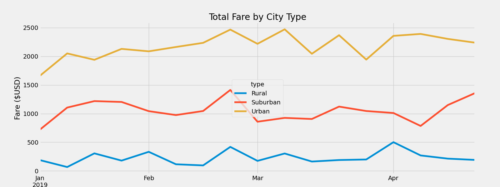

# PyBer_Analysis

## Overview of Analysis
Using Pandas and Matplotlib on Jupyter Notebook to analyze and create a summary DataFrame of ride sharing data by city type for Pyber.

## Technologies used:
* Python
* Matplotlib
* Pandas
* Jupyter Notebook 
* [ride_data.csv](https://github.com/anrobertson/PyBer_Analysis/blob/main/Resources/ride_data.csv)

 In the resources file we had both the ride data and the city data that were in CSV form. Once imported, I combined the data into a single dataset by using "merge". After the merge, it was time to summarize the data. Using the groupby method, I singled out the "types" of cities (urban, suburban, and rural) and found the sum of drivers and the sum of the fare. Following that, I found the average fare per ride by dividing the fare byt the type of city with the amopunt of rides by the type of city. I also calculated the average fare per driver by dividing the fares by the type of city with the drivers by the type of city. Once the information was collected, I made a new data frame showing the total rides, total drivers, total fares, average fare per ride, and average fare per driver based off the city types.

The project called for multiple line plot as the visual to show the total weekly fares. I read the merged data frame and used groupby to pull the type of city, the dates of the ride and founmd the sum of the ride fares. Afterwards, it was time to reset the data frame we created prior. The reasoning behind reseting the data frame is to place the "type", "date" and fare into their own columns which makes it more suitable for creating a line plot. Next I created my pivot table, I set my index to the date to pull the the rides starting from the first ride and then ongoing. The columns were take from the "type" so on our table we see "Rural", "Suburban" and "Urban" with the value being the "fare" amount.

The project called to pull the fare amount from certain dates. To do that, I created another data frame and pulled from my "total_fare_per_date_pivot" data frame and used the loc method to pull from January 2019 to April 2019. Once I obtained that information, I had to set the "date" index to a "datetime" datatype. This was necessary to use the resample( ) method to pull the information by the week. The first step I took with resampling was creating my new data frame. I took my previous data frame and used ".resample( )". Within the parenthesis I placed 'W' for "week". and collected the sum of fares for each week.

The final step was to creat our line plot. I imported the style from matplotlib and the object-orientated interface method. I set the colors using, set the line width for the plot, added a title, y label and x label. I then took the image and saved it into my analysis folder and showed the ending result!
### Weekly Fare Line Plot

